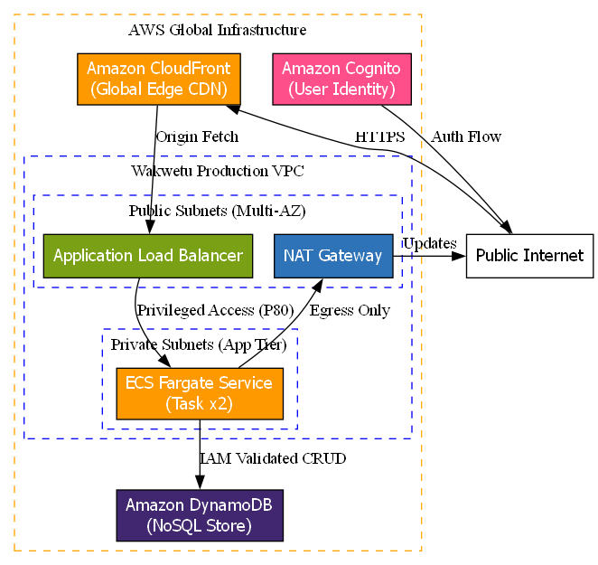
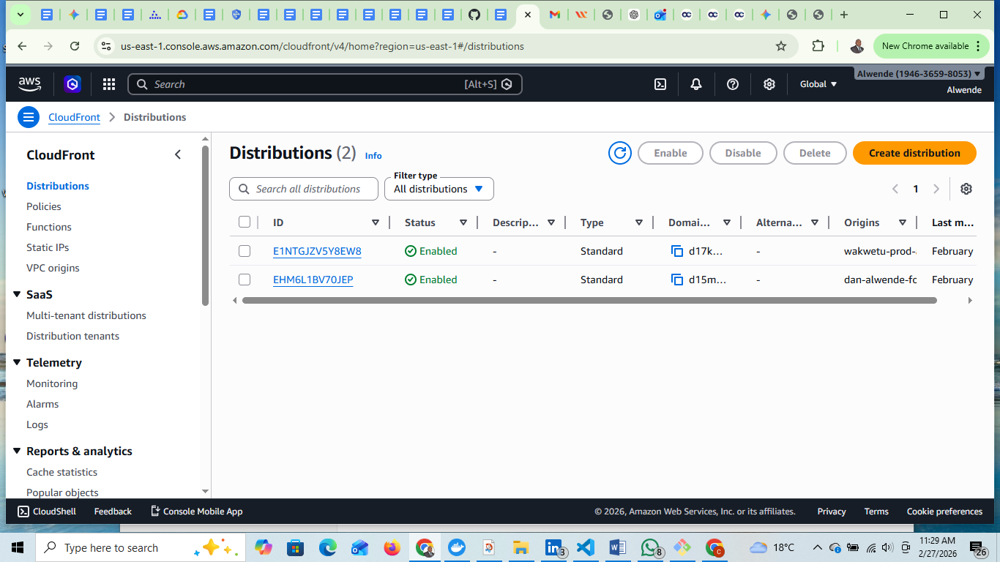
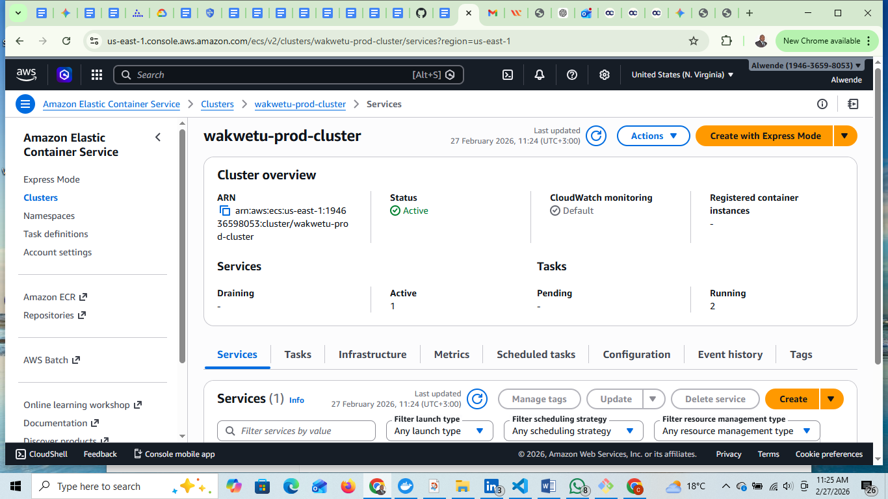
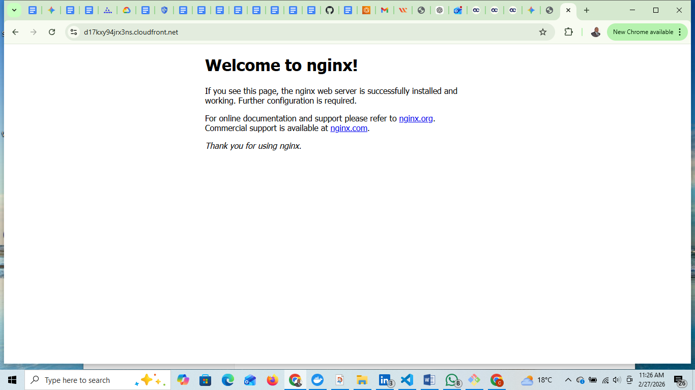

# Guidance-Grade Three-Tier Production Stack (AWS)
**Lead Enterprise Solutions Architect:** Dan Alwende, PMP

## 🏗️ Project Architecture
This project demonstrates the deployment of a resilient, serverless, and globally distributed application stack on AWS. It utilizes a **"Sovereign Factory"** approach where every tier is governed by code.

## 🛡️ Live Evidence & Validation
### 1. Global Edge Delivery (CloudFront)
The application is served via AWS Edge locations to ensure single-digit millisecond latency globally.

### 2. Orchestrated Compute (ECS Fargate)
The engine room runs on serverless containers across multiple Availability Zones for 99.99% availability.

### 3. End-to-End Delivery
Verification of the live "nginx" production environment served through the Load Balancer.

## 🛠️ Tech Stack
- **Edge:** Amazon CloudFront (Global CDN)
- **Identity:** Amazon Cognito (User Auth)
- **Compute:** AWS ECS Fargate (Serverless Containers)
- **Load Balancing:** Application Load Balancer (Multi-AZ)
- **Database:** Amazon DynamoDB (NoSQL)
- **Network:** VPC with NAT Gateway (Private Isolation)

---
*Developed for the Wakwetu Executive Project Portfolio.*
